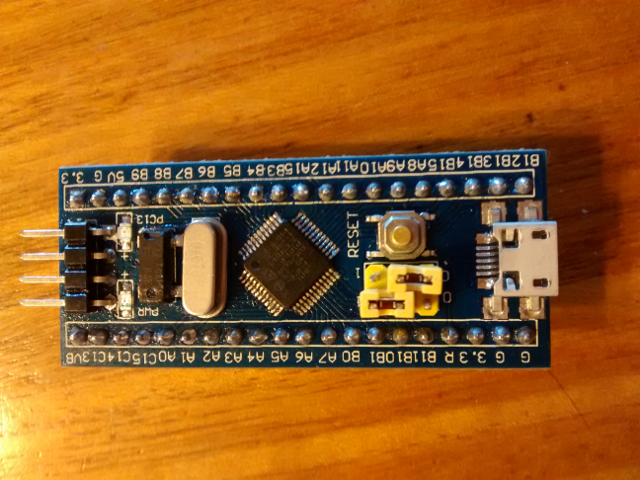

# Experimentos con STM32

## Placas utilizadas ##
Experimentando con placas SMT32F103 (compradas en AliExpress) y la IDE de Arduino en Linux Debian (Testing). La primera placa corrresponde a la siguiente:


La aplicación stm32flash muestra:

```
$ stm32flash /dev/ttyUSB0 
stm32flash 0.4

http://stm32flash.googlecode.com/

Interface serial_posix: 57600 8E1
Version      : 0x22
Option 1     : 0x00
Option 2     : 0x00
Device ID    : 0x0410 (Medium-density)
- RAM        : 20KiB  (512b reserved by bootloader)
- Flash      : 128KiB (sector size: 4x1024)
- Option RAM : 16b
- System RAM : 2KiB
```

La placa posee el led en `PA1` y se programa vía serial utilizando los pines `Rx/Tx` que posee.

Otra placa recibida para poder experimentar es la sigiente:



pero se quemó a los pocoso minutos, probablemente conecté equivocadamente algunos de los muchos cables que estaba manipulando. Afortunadamente perdí sólo unos US$4,0

---

## STM32 Arduino ##

Descargar los archivos requeridos para trabajar en la IDE de Arduino desde el proyecto [STM32_Arduino](https://github.com/rogerclarkmelbourne/Arduino_STM32) y descomprimir en el directorio `hardware` de Arduino.


Como es común, se ha de establecer el pin `boot0` en 1 y el pin `boot1` en 0 para grabar el firmware. Al finalizar poner ambos pines en 0.


## Referencias ##
- Proyecto [STM32_Arduino](https://github.com/rogerclarkmelbourne/Arduino_STM32) 
- Arduino for STM32 [STM32duino](http://www.stm32duino.com/)


